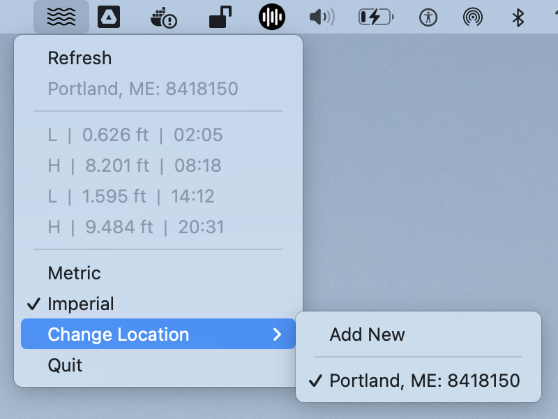
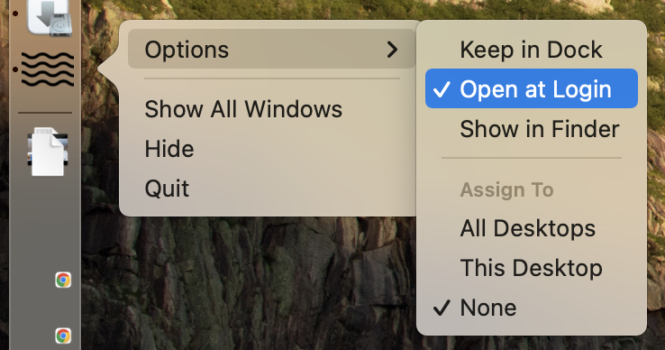
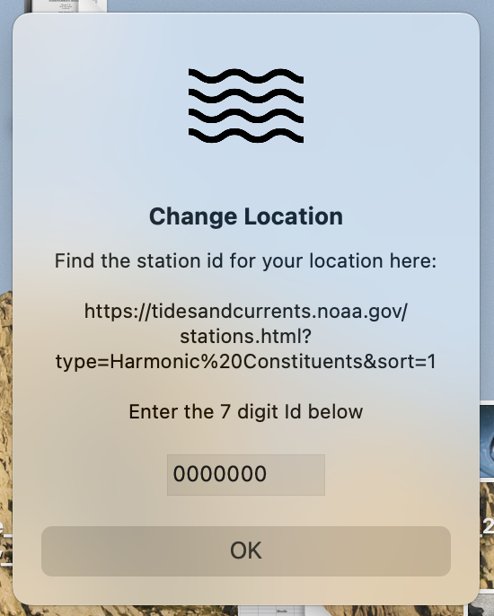

# Tide-Bar

A menu bar app for MacOS to show todays tides for a region of your choice!

If you want it to start automatically set this from your dock

## Set Up

Clone this repo and run `installer.sh` (this assumes having python3 installed) and the app should be installed into your applications folder.

## Changing Locations

Click the change location button and enter the code found on [NOAA's site](https://tidesandcurrents.noaa.gov/stations.html?type=Harmonic%20Constituents&sort=1) for the tide station that you want to view.

